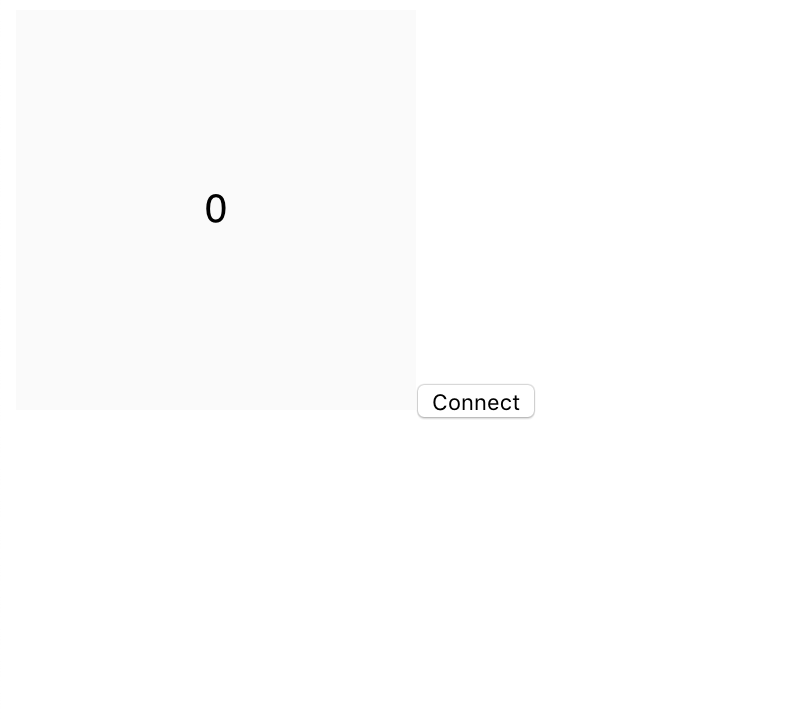
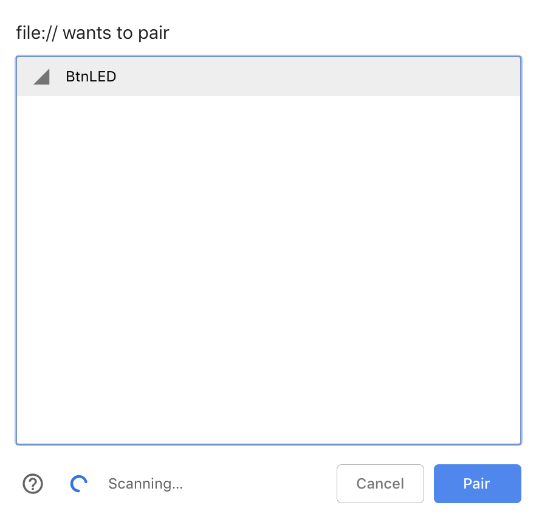
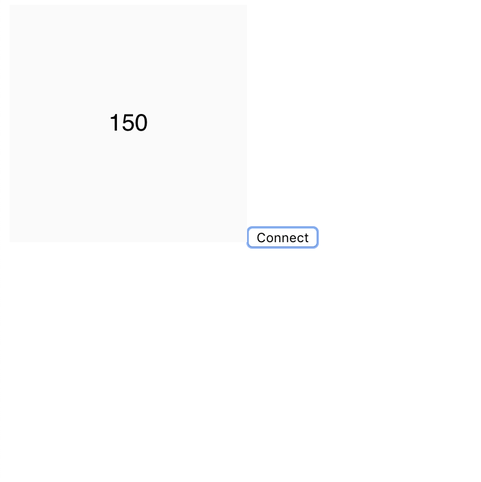

<h1 style="color:red">This website is NOT up-to-date, it has been moved to 👇 [https://itpnyu.github.io/p5ble-website](https://itpnyu.github.io/p5ble-website)</h1>


p5.ble.js enables communication between your BLE devices and your p5 sketch. With p5.ble.js, you can request and connect to nearby Bluetooth devices, read/write Bluetooth characteristics, start/stop notifications.

The library is supported by code examples, tutorials that cover many popular Bluetooth LE devices.

p5.ble.js is inspired by [p5.serialport](https://github.com/vanevery/p5.serialport), [p5.js](https://p5js.org/), [Web Bluetooth API](https://developer.mozilla.org/en-US/docs/Web/API/Web_Bluetooth_API), and [Processing Serial Library](https://processing.org/reference/libraries/serial/index.html).

## Usage

Download the [minified](https://unpkg.com/p5ble@latest/dist/p5.ble.min.js), or use the online version and add it to the head section of your HTML document:

```javascript
<script src="p5.ble.min.js" type="text/javascript"></script>
```
or 
```javascript
<script src="https://unpkg.com/p5ble@latest/dist/p5.ble.min.js" type="text/javascript"></script>
```

```html
<!DOCTYPE html>
  <html>
    <head>
      <title>Getting Started with p5.ble.js</title>
      <script src="https://cdnjs.cloudflare.com/ajax/libs/p5.js/0.7.2/p5.js"></script>
      <script src="https://cdnjs.cloudflare.com/ajax/libs/p5.js/0.7.2/addons/p5.dom.min.js"></script>
      <script src="https://unpkg.com/p5ble@latest/dist/p5.ble.min.js"></script>
    </head>

    <body>
      <script>

        // Your code will go here

      </script>
    </body>
  </html>
```

That's all!

## Connect to a BLE device and read from one characteristic:

Let's add something more to connect to a BLE device and read from one characteristic.

```html
<!DOCTYPE html>
  <html>
    <head>
      <title>Getting Started with p5.ble.js</title>
      <script src="https://cdnjs.cloudflare.com/ajax/libs/p5.js/0.7.2/p5.js"></script>
      <script src="https://cdnjs.cloudflare.com/ajax/libs/p5.js/0.7.2/addons/p5.dom.min.js"></script>
      <script src="https://unpkg.com/p5ble@latest/dist/p5.ble.min.js"></script>
    </head>

    <body>
      <script>
      const serviceUuid = "19b10010-e8f2-537e-4f6c-d104768a1214";
      let myCharacteristic;
      let myValue = 0;
      let myBLE;

      function setup() {
        // Create a p5ble class
        myBLE = new p5ble();

        createCanvas(200, 200);
        textSize(20);
        textAlign(CENTER, CENTER);

        // Create a 'Connect' button
        const connectButton = createButton('Connect')
        connectButton.mousePressed(connectToBle);
      }

      function connectToBle() {
        // Connect to a device by passing the service UUID
        myBLE.connect(serviceUuid, gotCharacteristics);
      }

      // A function that will be called once got characteristics
      function gotCharacteristics(error, characteristics) {
        if (error) console.log('error: ', error);
        console.log('characteristics: ', characteristics);
        myCharacteristic = characteristics[0];
        // Read the value of the first characteristic
        myBLE.read(myCharacteristic, gotValue);
      }

      // A function that will be called once got values
      function gotValue(error, value) {
        if (error) console.log('error: ', error);
        console.log('value: ', value);
        myValue = value;
        // After getting a value, call p5ble.read() again to get the value again
        myBLE.read(myCharacteristic, gotValue);
      }

      function draw() {
        background(250);
        text(myValue, 100, 100);
      }
      </script>
    </body>
  </html>
```
Get your BLE device ready. Make sure its service UUID matches the `serviceUuid` above. Read more about setup your BLE device here.

Open it in a web browser and you should see something like this:
<table><tr><td>

</td></tr></table>

Click connect to choose a BLE device to pair.
<table><tr><td>

</td></tr></table>

Then you should be able to read the value!
<table><tr><td>

</td></tr></table>

🌈
